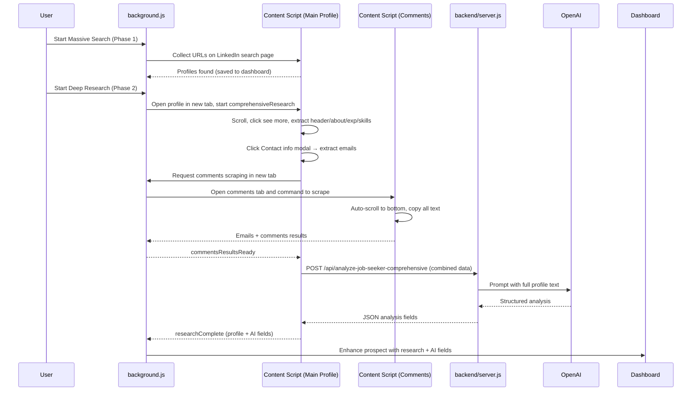

> Here's the pitch that started it all: [The Netwrk Outreach Tool](https://docs.google.com/presentation/d/1GwGM1NzUlpGz1CELFfxQ1nJtJ3jsnOR9MSgapJfi34U/edit?usp=sharing)
>
> Strategically pitched to the founder; the founder acted on the recommendation and developed the first production version within 2 weeks.

# TheNetwrk – LinkedIn Job Seeker Discovery (Chrome Extension + Backend)

<div align="center">


**Breadth first (collect 1000s of LinkedIn profiles) → Depth later (research each profile, extract emails, analyze with AI).**

[](https://chrome.google.com/webstore)
[](https://nodejs.org/)
[](https://openai.com/)

</div>

### What this does today
- **Phase 1 – Breadth (LinkedIn search pages):** Scroll-and-collect names + profile URLs from LinkedIn search results, saving thousands to the dashboard.
- **Phase 2 – Depth (per profile research):**
  - Main profile: scroll, click “see more”, collect all text, extract name/headline/about/experience/skills
  - Contact info: auto-clicks the “Contact info” modal and extracts emails if present
  - Comments: opens a separate tab and auto-scrolls comments to the bottom, copies all text, and parses for emails near the profile owner’s name
  - AI: sends comprehensive profile text to backend `/api/analyze-job-seeker-comprehensive` for scoring and structured fields
- **Dashboard:** Results and AI fields map back to the stored prospect.

### Architecture (high level)


## Setup

### Prerequisites
- Chrome (logged into LinkedIn)
- Node.js 18+
- OpenAI API key

### Install & Run
```bash
# 1) Clone
git clone https://github.com/LawrenceHua/The-Netwrk-Google-Chrome-Extension.git
cd The-Netwrk-Google-Chrome-Extension

# 2) Backend
cd backend
npm install
cp .env.example .env   # create if missing
# .env
# OPENAI_API_KEY=your_key
# PORT=3000
npm start

# 3) Extension
# chrome://extensions → Enable Developer mode → Load unpacked → select project root
```

## Usage
1) In LinkedIn search results, use the extension to start **Massive Search** (Phase 1). Profiles are saved to the dashboard.
2) Start **Deep Research** (Phase 2). For each prospect:
   - Main profile text is collected (with “see more” expansion)
   - “Contact info” modal is clicked and parsed for emails
   - Comments are scraped in a second tab, scrolled to the bottom (no early “mo” stop), copied, and parsed for emails near the owner’s name
   - Combined data is sent to the backend for AI scoring
3) Open the dashboard to see enhanced prospects with AI fields and any emails found.

## What we collect and analyze
- Name, headline, about summary
- Experience (title at company), skills (common tech skills)
- Contact emails from the “Contact info” modal (when available)
- Comment-derived emails (via full-page text parsing in comments)
- Comprehensive AI fields from backend:
  - `jobSeekerScore`, `isJobSeeker`, `confidence`
  - `careerStage`, `techBackground`, `industry`, `currentRole`
  - `experienceYears`, `techProficiency`
  - `contactability`, `remotePreference`, `networkingActivity`
  - `summary`, `notes`, `keySkills`, `jobSeekerIndicators`, `jobSeekingSignals`
  - `extractedEmails` (deduped from contact + comments)

## Backend API (implemented)
```http
POST /api/analyze-job-seeker-comprehensive
Content-Type: application/json

{
  name, headline, about, experiences, skills,
  commentsWithAtSymbols, contactEmails, commentEmails,
  combinedText, linkedinUrl
}

→ Returns all fields needed by the dashboard (see above)
```

## Notes on reliability
- The “Contact info” click uses multiple selectors and scroll-into-view before clicking. It logs attempts and falls back to ESC to close the modal.
- Comments scraping runs in a separate tab and auto-scrolls to the bottom; it does not stop on partial matches like “mo”. This avoids premature termination.
- Content script acknowledges long-running actions immediately to avoid Chrome’s “message channel closed” errors; final results are sent async via runtime messages.

## Project structure
```
TheNetwrk/
├── src/
│   ├── js/
│   │   ├── background.js          # Orchestrates tabs, saves results, merges AI fields
│   │   ├── content.js             # Scraping logic (main + comments auto-detect)
│   │   └── url-collector.js       # Breadth URL collection (search results)
├── backend/
│   └── server.js                  # Express server + OpenAI integration
├── manifest.json                  # Chrome MV3 manifest
└── README.md
```

## License
This project is proprietary software owned by Lawrence Hua. All rights reserved. See the [LICENSE](LICENSE).

For permission inquiries: lawrencehua2@gmail.com
