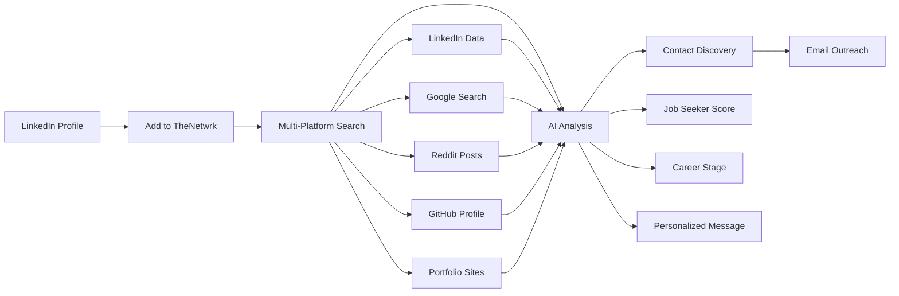

# 🌐 TheNetwrk - AI-Powered Multi-Platform Prospect Discovery

<div align="center">


**Discover job seekers across multiple platforms, analyze with AI, and send personalized outreach emails**

[](https://chrome.google.com/webstore)
[](https://developer.mozilla.org/en-US/docs/Web/JavaScript)
[](https://nodejs.org/)
[](https://openai.com/)

</div>

## 🚀 Overview

TheNetwrk is a revolutionary Chrome extension that transforms how you discover and connect with job seekers. Instead of being limited to LinkedIn Premium, it searches across **multiple platforms** (LinkedIn, Google, Reddit, GitHub, portfolio sites) to find contact information and assess job-seeking intent using AI.

### ✨ Key Features

- 🔍 **Multi-Platform Search**: LinkedIn + Google + Reddit + GitHub + Portfolio sites
- 🤖 **AI Analysis**: Job seeker scoring, career stage detection, and personalized messaging
- 📧 **Direct Email**: Send emails from your Gmail account with AI-generated messages
- 🎯 **Smart Targeting**: Identifies career changers, bootcamp graduates, and active job seekers
- 💎 **Contact Discovery**: Finds emails, phones, and social profiles across the web
- 📊 **Dashboard**: Beautiful interface to manage prospects and track outreach

## 🎯 How It Works



### Multi-Platform Discovery Process:

1. **LinkedIn**: Profile data, recent activity, job seeking signals
2. **Google Search**: `"Name" portfolio email contact`
3. **Reddit**: `"Name" job search career change`
4. **GitHub**: Developer profiles and repositories
5. **Portfolio Sites**: Behance, Dribbble, personal websites
6. **AI Analysis**: Job seeker scoring and personalized messaging

## 📋 Quick Start

### Prerequisites

- Chrome Browser
- Node.js 16+
- Gmail account with App Password
- OpenAI API key

### Installation

```bash
# 1. Clone repository
git clone https://github.com/LawrenceHua/The-Netwrk-Google-Chrome-Extension.git
cd The-Netwrk-Google-Chrome-Extension

# 2. Install backend dependencies
cd backend
npm install

# 3. Configure environment
cp .env.example .env
# Add your OpenAI API key to .env

# 4. Start backend server
npm start

# 5. Load Chrome extension
# Open chrome://extensions/
# Enable Developer mode
# Click "Load unpacked" and select project folder

# 6. Setup Gmail authentication in extension
```

### Step-by-Step Setup Guide

<details>
<summary>📧 Gmail Setup (Click to expand)</summary>

1. **Enable 2-Factor Authentication** on your Google account
2. **Generate App Password**:
   - Go to [Google App Passwords](https://myaccount.google.com/apppasswords)
   - Select "Mail" → "Other (Custom name)"
   - Enter "TheNetwrk Extension"
   - Copy the 16-character password
3. **Login in Extension**: Use your Gmail + App Password

</details>

<details>
<summary>🔧 Backend Configuration (Click to expand)</summary>

1. **Create `.env` file** in backend folder:
```env
OPENAI_API_KEY=your_openai_api_key_here
PORT=3000
```

2. **Start the server**:
```bash
cd backend
npm start
```

3. **Verify it's running**: Visit `http://localhost:3000/api/health`

</details>

## 🔍 Multi-Platform Discovery

### What It Searches For:

#### **LinkedIn**
- Profile information and recent activity
- Job seeking signals in posts/comments
- Skills, experience, and career stage

#### **Google Search**
- `"John Smith" portfolio website`
- `"John Smith" site:github.com`
- `"John Smith" email contact`
- `"John Smith" @gmail.com`

#### **Reddit**
- `"John Smith" site:reddit.com "looking for work"`
- Career change discussions
- Tech pivot conversations
- Job seeking posts

#### **Portfolio Sites**
- Behance and Dribbble profiles
- Personal websites and contact pages
- GitHub repositories and profiles

## 🤖 AI-Powered Analysis

For each prospect, the AI analyzes:

```json
{
  "jobSeekerScore": 85,           // 0-100% likelihood of job seeking
  "careerStage": "Mid-level",     // Entry/Mid/Senior/Executive
  "techBackground": "Strong",     // None/Basic/Moderate/Strong
  "industry": "Software Dev",     // Primary industry
  "keySkills": ["React", "Node"], // Top relevant skills
  "jobSeekingSignals": 3,         // Active indicators (0-5)
  "personalizedMessage": "Hi John, I noticed your recent React project..."
}
```

## 📊 Dashboard Features

### Prospect Management
- **Smart Filtering**: Sort by job seeker score, email availability
- **Bulk Actions**: Send emails to multiple prospects
- **Status Tracking**: Pending, drafted, sent emails
- **Contact Indicators**: Visual email/phone availability

### Email Campaign
- **AI Messages**: Personalized based on prospect analysis
- **Gmail Integration**: Sends from your account
- **Professional Templates**: Consistent formatting
- **Delivery Tracking**: Success/failure status

## 🛡️ Security & Privacy

- **Local Storage**: All prospect data stored locally in browser
- **Secure Auth**: Gmail App Passwords (not regular passwords)
- **No Data Collection**: Extension doesn't send data to external servers
- **Rate Limiting**: Respectful scraping with delays
- **Environment Variables**: No hardcoded secrets

## 🔧 API Endpoints

```bash
# Authentication
POST /api/auth/login     # Gmail login
GET  /api/auth/status    # Check auth status
POST /api/auth/logout    # Logout

# Email Services  
POST /api/send-email     # Send personalized email
GET  /api/emails         # Get email history

# AI Analysis
POST /api/analyze        # Analyze prospect data
POST /api/generate-message # Generate personalized message

# Prospects
GET  /api/prospects      # Get all prospects
POST /api/prospects      # Add new prospect
```

## 🎨 Customization

### Message Templates

Edit in `src/js/message-drafting.js`:

```javascript
function formatLinkedInMessage(name, message) {
  return `Hey ${name},

${message}

Best regards,
Lawrence
Growth Intern at TheNetwrk`;
}
```

### Scoring Criteria

Modify AI prompts in `backend/server.js` to adjust job seeker scoring.

## 🧪 Testing

### Backend API

```bash
# Health check
curl http://localhost:3000/api/health

# Test authentication
curl -X POST http://localhost:3000/api/auth/login \
  -H "Content-Type: application/json" \
  -d '{"email":"your@gmail.com","password":"app-password"}'
```

### Extension Testing

1. Load extension in Chrome
2. Visit LinkedIn profiles
3. Check console logs (F12)
4. Verify dashboard functionality

## 📁 Project Structure

```
TheNetwrk-Google-Chrome-Extension/
├── src/
│   ├── assets/          # Extension icons and images
│   ├── css/             # Stylesheets
│   ├── js/              # JavaScript modules
│   │   ├── background.js    # Service worker
│   │   ├── content.js       # Content script
│   │   ├── google-scout.js  # Multi-platform search
│   │   ├── deep-researcher.js # LinkedIn scraping
│   │   └── ...
│   └── pages/           # HTML pages
├── backend/
│   ├── server.js        # Express server
│   ├── package.json     # Dependencies
│   └── .env.example     # Environment template
├── manifest.json        # Extension manifest
└── README.md           # This file
```

## 🤝 Contributing

1. Fork the repository
2. Create feature branch (`git checkout -b feature/amazing-feature`)
3. Commit changes (`git commit -m 'Add amazing feature'`)
4. Push to branch (`git push origin feature/amazing-feature`)
5. Open Pull Request

## 📝 License

This project is licensed under the MIT License - see the [LICENSE](LICENSE) file for details.

## 📞 Support

- **Issues**: [GitHub Issues](https://github.com/LawrenceHua/The-Netwrk-Google-Chrome-Extension/issues)
- **Email**: lawrencehua2@gmail.com

## 🎯 Roadmap

- [ ] Chrome Web Store publication
- [ ] Additional platform integrations (Twitter, Instagram)
- [ ] Advanced AI scoring algorithms
- [ ] Team collaboration features
- [ ] Analytics and reporting dashboard

---

<div align="center">

**Made with ❤️ by Lawrence Hua**

*Revolutionizing recruitment through AI and multi-platform discovery*

[⭐ Star this repo](https://github.com/LawrenceHua/The-Netwrk-Google-Chrome-Extension) | [🐛 Report Bug](https://github.com/LawrenceHua/The-Netwrk-Google-Chrome-Extension/issues) | [💡 Request Feature](https://github.com/LawrenceHua/The-Netwrk-Google-Chrome-Extension/issues)

</div>